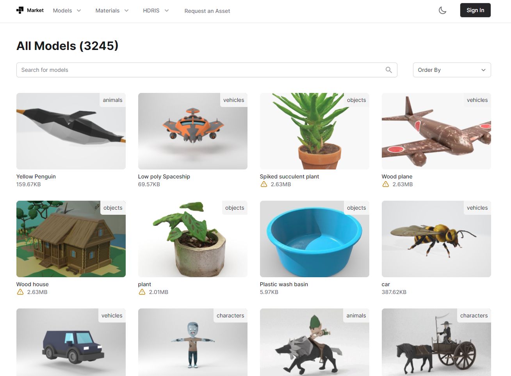

# Market

[📦 Download CC0 assets ready to use in your next 3D Project](https://3d-market.vercel.app)



## Run Locally

Clone the project

```bash
  git clone https://github.com/3posol/3d-market
```

Go to the project directory

```bash
  cd 3d-market
```

Install dependencies

```bash
  yarn
```

Start the server

```bash
  yarn dev
```

Some needs to know:

- Login does not work locally
- No environment keys are needed unless you need to do things that change the database

## Features

- 🔎 free minified/ready-to-use CC0 models/textures/hdris
- 🚥 starters for threejs and react-three-fiber
- 👥 accounts
- 📬 request assets
- 🥇 favorites, comments, ratings
- 🔌 api endpoint
- ☁️ CDN with caching
- ⚙️ Material Editor

## Roadmap

- components category
- npm package with this

## Appendix

All assets and API can be found here: https://github.com/3posol/3d-market

## License

[MIT](https://github.com/3posol/licenses)
